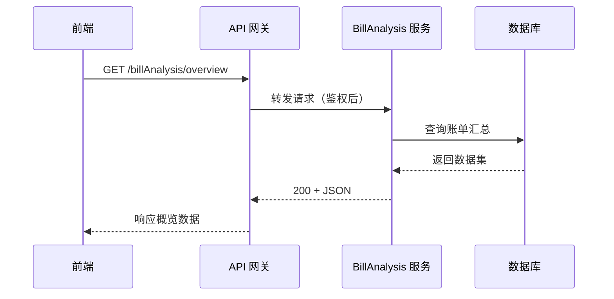

# ```agent 代码块示例

## 示例 1：填充下方表格（默认路径）

**处理前：**

````markdown
# 账单分析模块

```agent
根据 src/api/modules/billAnalysis/index.ts 补全下方「接口清单」表格，包含接口名、HTTP 方法、路径、简要说明。
```

## 接口清单

| 接口 | 方法 | 路径 | 说明 |
|------|------|------|------|
````

**处理后：**

```markdown
# 账单分析模块

## 接口清单

| 接口 | 方法 | 路径 | 说明 |
|------|------|------|------|
| getOverview | GET | /billAnalysis/overview | 获取账单概览 |
| getComposition | GET | /billAnalysis/composition | 获取账单构成 |
```

` ```agent ` 代码块已删除，仅保留表格内容。

---

## 示例 2：多条指令批量处理（从上到下）

**处理前：**

````markdown
# 组件文档

```agent
根据 OverviewCard/index.vue 补全下方 OverviewCard 的 Props 表格。
```

## OverviewCard

| Prop | 类型 | 默认值 | 说明 |
|------|------|--------|------|

```agent
在下方「使用示例」中补充 OverviewCard 的基础用法代码块。
```

## 使用示例

````

**默认行为：** 一次调用处理全部 ` ```agent ` 块，按文档顺序从上到下执行，完成后两个代码块均删除。

**处理后：**

````markdown
# 组件文档

## OverviewCard

| Prop | 类型 | 默认值 | 说明 |
|------|------|--------|------|
| title | string | — | 卡片标题 |
| data | object | {} | 概览数据 |

## 使用示例

```vue
<OverviewCard title="概览" :data="overviewData" />
```
````

用户可说：「只处理第一条」以限定范围。

---

## 示例 3：多行指令（块内自然换行）

**处理前：**

````markdown
```agent
为下方 DailyPriceTrend 组件撰写说明，需包含：
- 组件职责（一句话）
- 依赖的数据字段
- 与 OverviewCard 的协作关系
```

## DailyPriceTrend

````

**处理后：** 在 `## DailyPriceTrend` 下写入说明，` ```agent ` 代码块删除。

---

## 示例 4：失败、重试与手动跳过

**失败时保留代码块：**

````markdown
```agent
根据 src/api/modules/notExist/index.ts 补全下方接口表。
```
<!-- @agent-error: 找不到 src/api/modules/notExist/index.ts -->

## 接口清单

| 接口 | 方法 | 说明 |
|------|------|------|
````

用户修正路径后可再次 `@md-agent` 重试；成功后代码块与 `@agent-error` 注释一并删除。

**手动跳过：**

````markdown
```agent-skip
暂不生成性能优化章节。
```
````

` ```agent-skip ` 块永久忽略，不删除、不产出。

---

## 示例 5：时序图（Mermaid sequenceDiagram）

**处理前：**

````markdown
# 账单分析模块

```agent
根据 src/api/modules/billAnalysis/index.ts 及相关调用链，在下方绘制「获取账单概览」请求的时序图（Mermaid sequenceDiagram），参与者需包含：前端、API 网关、BillAnalysis 服务、数据库。
```

## 获取账单概览时序图

````

**处理后：**

````markdown
# 账单分析模块

## 获取账单概览时序图


````

` ```agent ` 代码块已删除，下方保留 Mermaid 时序图代码块；指令可指定参与者、关键步骤或需覆盖的接口路径。
